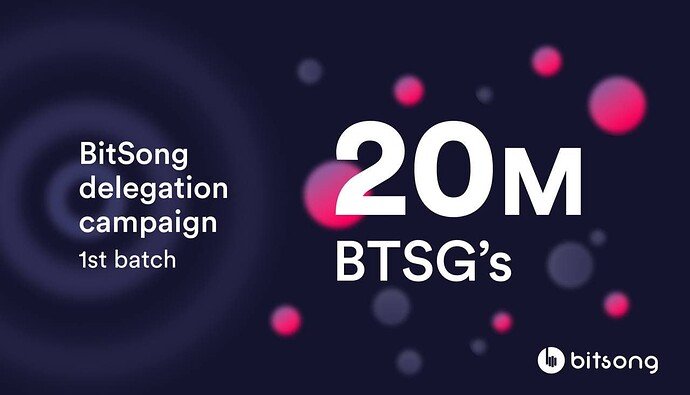

# BitSong Delegation Program

Hello everyone, as reported in the previous article, we want to present the Delegation Campaign that will be carried out by BitSong in the days coming.

Our main goal is to activate the community as much as possible, making it participatory and interactive so that decentralization can begin to grow gradually and obtain a vibrant ecosystem of tools, research groups, companies and applications that sets fire to the network for long-term success.

## Amount of tokens available for the Campaign:

- 20,000,000 btsg (20 Milion)

## Rounds of Delegation

4 rounds as follows:

### Round 1

- Amount: 5.000.000btsg
- Start Date: Monday April 26th, 2021
- End Date: October 19th, 2021 (after 180 days bitsong will re-evaluate the delegation) _This Round has already been assigned to investor, contributor and early validators_

> Check out **[here](https://docs.google.com/spreadsheets/d/1ksM1ohzFqNLsBha-DJ5EnDrdvwt0FjatVBFnNvMiNlA/edit?usp=sharing)** if you got any delegation.

### Round 2

- Amount: 5.000.000btsg
- Start Date: May 10th, 2021
- End Date: October 19th, 2021 (after 180 days bitsong will re-evaluate the delegation)

### Round 3

- Amount: 5.000.000btsg
- Start Date: May 24th, 2021
- End Date: October 19th, 2021 (after 180 days bitsong will re-evaluate the delegation)

### Round 4

- Amount: 5.000.000btsg
- Start Date: June 7th, 2021
- End Date: October 19th, 2021 (after 180 days bitsong will re-evaluate the delegation)

## Qualification rules

**To qualify for BitSong delegations program, a validator must:**

- Fill the **[form](https://forms.gle/eNDy4tUQj6DsqVA18)** (for each round)
- Have an active validator (even with 1 btsg, if validator holds erc-20 btsg then he has to perform a swap on the swapping dedicated **[Discord Server](https://discord.gg/n7feC3dC5P)**)
- 10% max commission rate
- Have less than 3M bonded tokens

## Delegation Criteria

- Build and maintain ecosystem tools: Block explorers, monitoring tools, dashboards, wallets, media server,
- Set an example of validator operation best practices: Publishing material help other validators improve their security infrastructure and understand threat models, engaging in support discussions to onboard new validators
- Lead community engagement: Running public facing communities and engaging in activities that help to onboard new participants into the ecosystem

## Undelegate Criteria

### Slashing

Slashing will result in

- Downtime => 25%
- Double sign => 100%

Any doubts you may have about the above said, do not hesitate to contact us via the communication channels dedicated to the validators we have available (Telegram, Discord) or comment here on the forum.

## Links

[**Website**](https://bitsong.io/) **|** [**Discord**](https://discord.gg/E3qEnzb) **|** [**Telegram**](https://t.me/BitSongOfficial) **|** [**Github**](https://github.com/bitsongofficial/go-bitsong) **|** **[Mainnet](https://explorebitsong.com/)**
